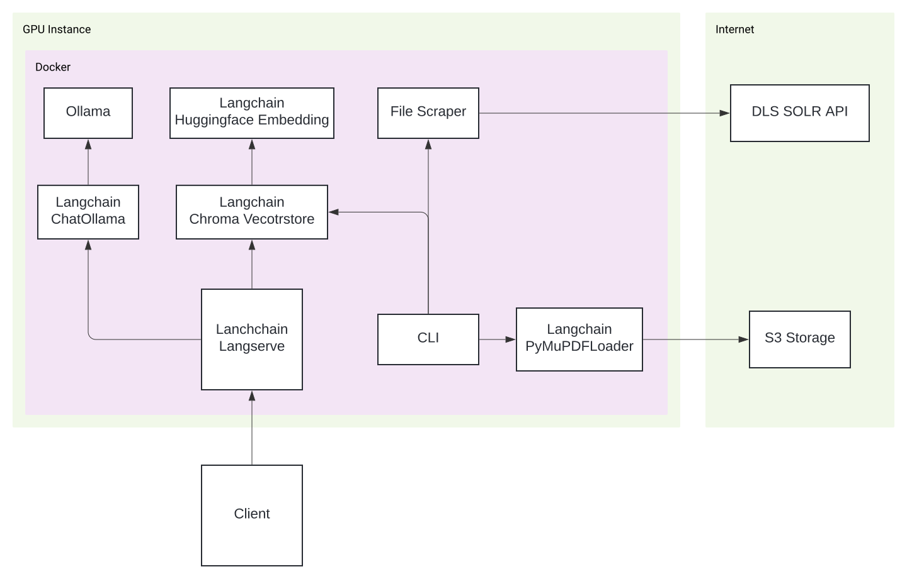

# dRAG Queen

<p align="center">
  
</p>

Die `dRAG Queen` bietet eine RAG Schnitstelle mit dem Textkorpus aus PDF Dokumenten aus dem DLS von Basel Stadt. Die Schnitstelle ist via RESTful API zugänglich und erlaubt es den Benutzenden in natürlicher Sprache Fragen zum Textkorpus zu stellen. Das System holt sich die nötigen Informationen aus dem Textkorpus und generiert mittels einem LLM eine Antwort in natürlicher Sprache.

Das Projekt `dRAG Queen` ist im Rahmen einer Abschlussarbeit von Kevin Bieri für das CAS Data Science entstanden.

## Ziel

Benutzern soll es möglich sein durch eine Eingabe in einem Prompt Informationen aus dem Archiv zu ziehen. Das LLM soll dabei Zugriff auf den Inhalt aller Dokumente haben, um die Antworten auf Basis der Archivs zu machen.

## Business Value

Mit diesem Feature wollen wir einen weiteren USP für das DLS schaffen. Dieser USP soll zusätzlich in Verkaufsgesprächen und Marketing genutzt werden können, um uns von den Konkurrenten abzuheben.

## Lösung

Eine RAG Applikation besteht aus folgenden Hauptkomponenten:
- Eine Frage, die der Applikation gestellt werden soll
- Ein Kontext aus einem Textkorpus, um die Gestellte Frage zu beantworten
- Ein Retriever, um den passenden Kontext zur gestellten Frage abzufragen
- Ein LLM, um mit Hilfe des Kontexts die Frage in natürlicher Sprache zu beantworten

Das Python Framework [Langchain](https://www.langchain.com/) bietet diese nögtigen Werkzeuge und Komponenten an, um eine solche Applikation zu bauen. Die Applikation bildet dabei eine Kette der nögiten Komponenten aus Langchain ab. Jede Komponente ist individuell austasuchbar, um auf neue Anforderungen zu reagieren.

Der Textkorpus für den Kontext wurde aus den PDF Dokumenten vom [Digitalen Lesesaal vom Kanton Basel](https://dls.staatsarchiv.bs.ch) erstellt. Der Korpus besteht grösstenteils aus Sitzungsprotokollen und deren Beschlüssen. Dazu wurde die SOLR API vom DLS abgefragt. Der Scraper iteriert dabei über jedes Dokument und filtert die PDF Dokumente heraus. Die Dokumente werden anschliessend vom S3 Speicher heruntergeladen und die Texte mit [pyMuPDF](https://pymupdf.readthedocs.io/en/latest/) extrahiert. Es hat sich herausgestellt, dass pyMuPDF gegenüber den anderen Varianten die Langchain anbietet die Dokumente am schnellsten ohne Einbussen der Präzision verarbeiten kann.

Die Texte werden anschliessen in Vektoren umgewandelt, damit die Applikation für eine Gestellte Frage ähnliche Dokumente für den Kontext finden kann. Dies nennt sich [Sentence Embedding](https://www.wikiwand.com/en/Sentence_embedding). In diesem Fall wurde das [all-MiniLM-L12-v2](https://huggingface.co/sentence-transformers/all-MiniLM-L12-v2) Modell von HuggingFace verwendet. Dieses Modell wurde speziell für die sentence embedding Aufgabe trainiert und kann daher für die Suche eines Kontexts verwendet werden.

Damit die Vektoren für den Korpus nicht bei jeder Frage neu berechnet werden müssen, werden diese in eine Datenbank abgespeichert. In diesem Projekt wurde die [Chroma](https://www.trychroma.com/) verwendet. Diese Datenbank ist speziell für das Abspeichern von vektoren konzipiert wurden. Chroma bietet ebenfalls Schnitstellen, um einen Kontext aus dem Korpus zu bilden.

Damit dem Benutzer eine Antwort in natürlicher Sprache präsentiert werden kann, wird ein LLM zum generieren von Texten hinzugezogen. [Ollama](https://ollama.ai/) bietet dabei eine Schnittstelle zu verschidenen Modellen über eine RESTful API an. In diesem Projekt wurde [Llama2](https://ai.meta.com/llama/) verwendet. Llama2 ist frei verfügbar und kann für kommerzielle Zwecke verwendet werden. Im prompt wird dem LLM nun die Frage zusammen mit dem Kontext aus Chroma gestellt. Das LLM versucht nun aus dem Kontext die Frage in natürlicher Sprache zu beantworten.

Diesen nötigen Komponten werden nun zu einer Langchain zusammengeschlossen. Mittels [langserve](https://python.langchain.com/docs/langserve) kann die Langchain als RESTful API einem HTTP Client zur Verfügung gestellt werden.

Anbei eine Übersicht der oben genannten Systemkomponenten:
<p align="center">
  
</p>

## Datenbank laden

**Datenbank leeren**

``` bash
docker compose run mindreader /app/cli.py reset
```

**Datenbank indexieren**

``` bash
docker compose run mindreader /app/cli.py load
```

## Starten der Applikation

``` bash
git clone https://github.com/4teamwork/mindreader
cd mindreader
docker compose up -d
```

Der Server läuft nun auf dem port 80. Auf dem Pfad `/ask/playground` kann mit der Langchain herumgespielt werden.

## Ausblick

Langchain bietet verschiedene Möglichkeiten wie der Kontext aufgebaut werden kann. Es gibt diverse [Retrievers](https://python.langchain.com/docs/modules/data_connection/retrievers/), die man ausprobieren könnte, um die Präzision zu verbessern. Ausserdem gibt es Möglichkeiten nur eine gewisse Anzahl Dokumente anhang eines Scoring abzufragen, um den Kontext für das LLM klein zu halten. Weiter wäre es interessant mit den [indexing](https://python.langchain.com/docs/modules/data_connection/indexing) von Langchain anzuschauen. Dieses Modul erlaubt es, die Dokumente immer auf dem neusten Stand zu halten. Aber da das Aufbauen der Embeddings nur etwa fünf Minuten dauert, ist das noch nicht nötig. Zur Zeit ist die Applikation frei Zugänglich. Es muss einen Weg geben die API gegen unauthorisierte Benutzer zu schützen. Weiter könnte man das LLM mit [Low-Rank Adaptation](https://arxiv.org/abs/2106.09685) auf den Textkorpus mittels Fine-Tuning abstimmen, um dem LLM zu helfen die Domäne der extrahierten Dokumente besser zu verstehen.


## Lessons Learned

Es hat sich herausgestellt, dass sich nicht jedes Modell gleich gut für sentence embedding eignet. Ich habe zuerst versucht mit dem LLM Model das embedding zu machen, aber das viel zu lange gedauert. Eine bessere Alternative ist `all-MiniLM-L12-v2`. Ausserdem habe ich bemerkt, dass sich die `pyMuPDF` Bibliothek zum Extrahieren von Texten aus PDF Dokumenten am besten eigent, da die Alternativen einfach zu langsam sind. Ein Segmentation Fault haut mich leider davon abgehalten den Embeddingprozess zu parallelisieren. Ich kann mir vorstellen, dass es mir Chroma in dieser Konfiguration nicht erlaubt gleichzeitig Dokumente abzuspeichern. Es würde die Möglichkeit geben Chroma asynchron anzusteuern, aber das wurde im Rahmen dieses Projekts nicht versucht. Ich habe auch festgestellt, dass man bei der Wahl der LLM aufpassen muss, da einige höhe Ansprüche an VRAM haben. Es war mir z.B. nicht gelungen mixtral als LLM einzusetzen, da es einfach zu gross ist.
